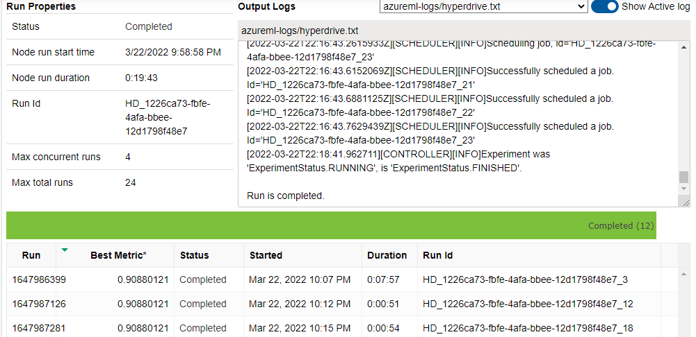
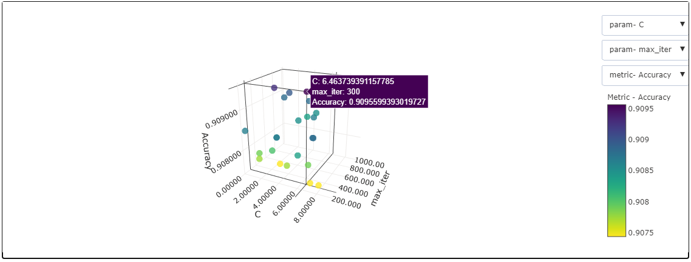
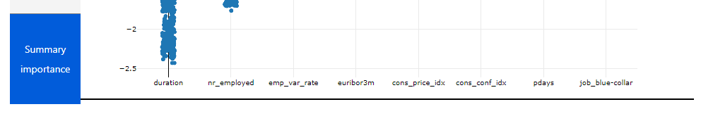
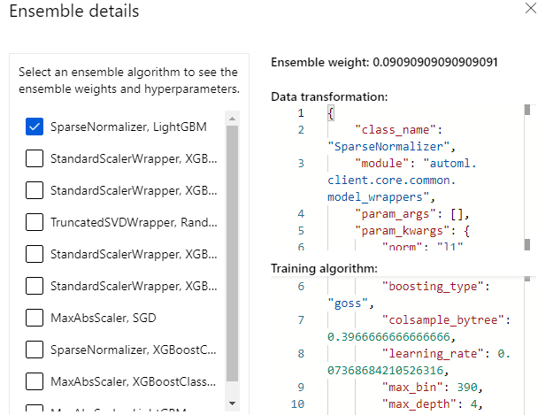
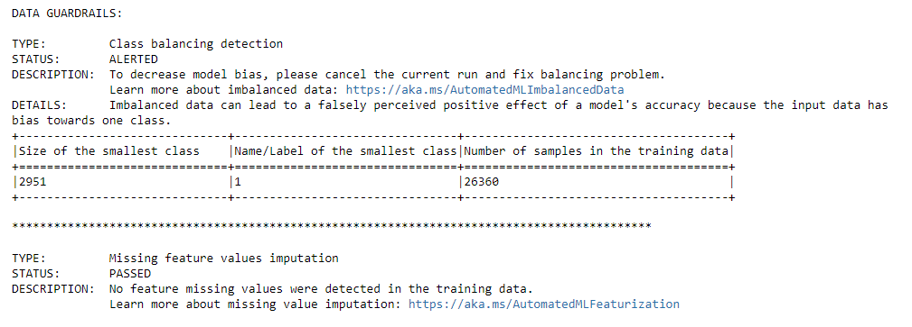
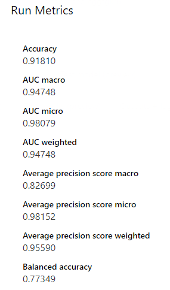
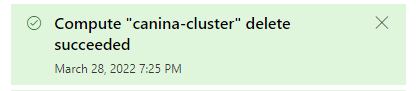

# Optimizing an ML Pipeline in Azure

## Overview
This project is part of the Udacity Azure ML Nanodegree.
In this project, we build and optimize an Azure ML pipeline using the Python SDK and a provided Scikit-learn model.
This model is then compared to an Azure AutoML run.

## Useful Resources
- [ScriptRunConfig Class](https://docs.microsoft.com/en-us/python/api/azureml-core/azureml.core.scriptrunconfig?view=azure-ml-py)
- [Configure and submit training runs](https://docs.microsoft.com/en-us/azure/machine-learning/how-to-set-up-training-targets)
- [HyperDriveConfig Class](https://docs.microsoft.com/en-us/python/api/azureml-train-core/azureml.train.hyperdrive.hyperdriveconfig?view=azure-ml-py)
- [How to tune hyperparamters](https://docs.microsoft.com/en-us/azure/machine-learning/how-to-tune-hyperparameters)

## Summary
**In 1-2 sentences, explain the problem statement: e.g "This dataset contains data about... we seek to predict..."**
This project uses the tabular dataset in the URL "https://automlsamplenotebookdata.blob.core.windows.net/automl-sample-notebook-data/bankmarketing_train.csv". This dataset has 19 attributes for training and the attribute 'y' for predictions. The attribute 'y' has two classes 'no' and 'yes'. It determines if a potentiel client would accept to make a deposit at the bank or decline the offer.

**In 1-2 sentences, explain the solution: e.g. "The best performing model was a ..."**
The model used by hyperdrive and provided by Scikit-learn, LogisticRegression, had an accuracy of 0.9095. However, the model obtained by an AutoMl run had a better accuracy with 0.9181. So, the best performing model was Voting Ensemble of the Automl run.

## Scikit-learn Pipeline
**Explain the pipeline architecture, including data, hyperparameter tuning, and classification algorithm.**

The diagram above represents the pipeline architecture of our project. We begin with creating the dataset from the provided link. After that, we clean our data using the "train.py" function "clean_data(data)". The function clean and one hot encode data, so the attribute 'y' is transformed from categorical ('no' and 'yes') to a numeric attribute (0 and 1). We split the data in the python script "train.py" for the hyperdrive usage and in the notebook for the AutoML run. We add another step for the AutoMLto register the data in a default datastore. We configure the hyper drive with hyperparameter tuning. Then, we retrieve the best model and register it. 

The steps for hyperparameter tuning :
Firstly, we define the search space for the model's hyperparameters "C" and "max_iter". We will sample the hyperparameters randomly.
"C" is continuous, so we choose randomly and uniformly from a range of [0.05, 10]. 
"max_iter" is descrete, so we choose randomly from these numbers 100, 300, 500, 700 and 1000.
Secondly, we specify the "Accuracy", defined in "train.py", as the primary metric to maximize.
Thirdly, we define an early termination policy, Bandit Policy.
Finally, we configure settings for resource allocation. The maximum number of training runs is "max_total_runs=24". We run concurrently 4 runs as our compute target is capable of. 

Here is a screenshot of the widget after the submition of the experiment.

The classification algorithm is the Logistic Regression provided by  Scikit-learn. Indeed, we want to predict the attribute 'y' with classification, because as we explained, 'y' has two classes '0' and '1'. In the "train.py" script, we parse two hyperparameters "C" and "max_iter". 
 - "C" represents the inverse of regularization strength. We discover the range of (0.05, 10). We choose until 10, because smaller values cause stronger regularization. Th default is 1.0
 - "max_iter" represents the maximum number of iterations to converge. The default is 100. We choose higher values in our hyperparameter tuning 

Here is a 3D scatter point figure, showing the best hyperparameters values and te best accuracy.

 

**What are the benefits of the parameter sampler you chose?**
Azure Machine Learning supports 3 sampling methods:
 - Grid sampling. It only supports choice. So, we can not use it for "C", which uses unifom function.
 - Bayesian sampling. It chooses based on the previous samples, and it is much costly in terms of the budget.
 - Random sampling. It supports the functions we need "choice" and "uniform". Also, it is not as costly as the Bayesian sampling. Moreover, it supports early termination of low-performance runs.
So, we chose random sampling as the parameter sampler. 

**What are the benefits of the early stopping policy you chose?**
We chose "BanditPolicy(slack_factor=0.1, evaluation_interval=1, delay_evaluation=3)" as the early stopping policy. The benefits are that this policy is based on the slack factor that terminates any run whose best metric is less than it. Also, we delay the first policy evaluation to the third interval. 

## AutoML
**In 1-2 sentences, describe the model and hyperparameters generated by AutoML.**
As in the architecture pipeline explained previously, we transform the data and split it. We register the training data in a default datastore. After that, we set parameters for AutoMLConfig:

By understanding the [AutoML config class](https://docs.microsoft.com/en-us/python/api/azureml-train-automl-client/azureml.train.automl.automlconfig.automlconfig?view=azure-ml-py), we extend our AutoML config constructor to include more parameters. So, we define a dictionary automl_settings that contains :
 - "experiment_timeout_minutes" : 30. This value is required to not to change, because it is much costly, if we increase it.
 - "enable_early_stopping" : True. To terminate the run if there is no improvement in the score.
 - Primary metric is 'accuracy'. We choose the accuracy to compare the model with LogisticRegression used with hyperdrive.
 - Featurization is 'auto'. We can know the features used in prediction thanks to explantion model.The main features are "duration", "nr_employed" and "euribor3m", as in the figure below.

 - "verbosity" : logging.INFO. It writes on the log file.
 - Number of cross validations is 5 folds. It divides our training set into 5 folds to train on 4 folds and do the prediction on the fifth one. It helpsour model to not overfit.
 - Enable ONNX compatible models as True. It let us save the model in onnx format.
 
 We define the AutoML configuration as follow :
 - Task = 'classification'. Our model should aim to predict a binary classification.
 - debug_log='automl_errors.log'. It helps us debug our program, if a problem occurs.
 - compute_target=compute_target. We use our compute cluster defined in the notebook. Also, our code checks for existing compute clusters before creating a new one.
 - training_data=data_train. As we explained before, we define our training dataset in 'data_train' parameter.
 - label_column_name='y'. It is our target to classify.
 - ** automl_settings. It is the containt of our dictionary explained previously.
 
Among many algorithms, the chosen model with AutoML is Voting Ensemble. It combines the results of classifiers and votes for the classifier with the best accuracy. We can seee in the figure below one of these classifiers and the value of their hyperparameters. 

## Pipeline comparison
**Compare the two models and their performance. What are the differences in accuracy? In architecture? If there was a difference, why do you think there was one?**
The model provided by Scikit-learn, LogisticRegression, and used with hyperdrive gave an accuracy of 0.9095. However, AutoML was capable of generating a complex model, Voting Ensemble, with a better accuracy of 0.9181. 

In architecture, hyperdrive requires to develop a python script "train.py". Also, it forces us to put a range of values for hyperparameter tuning. So, we can miss the optimal value of a hyperparameter, if we set the range below that value. Also, it can become much costly if we change the parameter sampler to Bayesian sampling. However, AutoML takes care of it for us. We just need to focus on the data we feed it. Indeed, AutoML gives us a warning about imbalanced data, which is overseen by hyperdrive. 

I think every method has its own benefits. In this case AutoML was able to perform better than LogisticRegression with hyperdrive.

## Future work
**What are some areas of improvement for future experiments? Why might these improvements help the model?**
For future experiments, the areas of improvement can be as follow :
 - Preprocess our data better. As AutoML gives a warning about imbalanced data as the figure below. 
 
 
 
 Indeed, when we have an imbalanced dataset, the model is biased toward the class that has much data. As a solution, we can add a resampling function in "train.py". Or we can change the metric of comparison as the accuracy can be misleading. The confusion matrix or Area under ROC Curve are better metrics for an imbalanced dataset.
 Also, the imbalanced accuracy is much useful in our case, because we have binary classification and imbalanced data. Here is the obtained value of imbalanced accurancy in AutoML.
 

  - If we had ressources, we could change the parameter sampler in hyperdrive configuration into Bayesian sampling. 
  - If it was not mandatory, we could choose a higher value for experiment_timeout_minutes in AutoML configuration.

## Proof of cluster clean up
**If you did not delete your compute cluster in the code, please complete this section. Otherwise, delete this section.**
**Image of cluster marked for deletion**
There is a line of code in the notebook. Also, here is a screenshot of a successful deletion of cluster.

 
